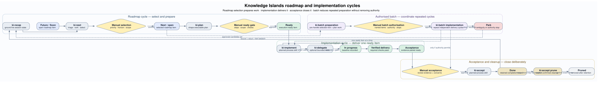

# Roadmap and implementation cycles

The roadmap cycle makes work ready; the implementation cycle delivers one ready item; the acceptance cycle closes and eventually prunes it.

Gold diamonds are manual authority gates.

`ki-batch` reduces repeated preparation and coordinates repeated bounded `ki-implement` cycles. Preparation uses the normal `ki-next` and `ki-plan` boundaries over named candidates; implementation runs only an approved batch authorisation. Each item normally stops at Acceptance. Only explicit named acceptance authority may continue through `ki-accept`, and pruning always requires separate confirmation.

The [DOT source](roadmap-implementation-cycles.dot) is canonical.
