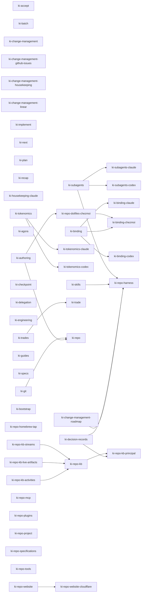

# skills

Knowledge Islands **Agent Skills** live here, one directory per skill. This is the most-built-out part of the harness today: governance skills hold standards and checkers, while process skills drive bounded workflows and lifecycles.

## Convention

Each skill is a directory containing a `SKILL.md` (YAML frontmatter — `name` + `description` required — followed by a markdown body), per the [Agent Skills open standard](https://agentskills.io/specification). Longer detail goes in `references/`, executables in `scripts/`, templates in `assets/` — all loaded on demand. The **directory name is the skill's `name`**: lowercase, hyphenated, matching the `name:` frontmatter exactly, since agents discover a skill by `name`, not path.

Skill quality conforms to the **`ki-skills`** standard (a sibling here) — run its AUDIT (`ki repo audit --skill ki-skills`) before shipping. The container these skills sit in — this five-part `skills/` / `subagents/` / `mcp/` / `evals/` / `hooks/` harness — conforms to **`ki-repo-harness`**.

## Adding a skill

1. Scaffold `<name>/SKILL.md` (run `ki-skills` Mode EDUCATE), adding `references/` / `scripts/` / `assets/` only as needed.
2. Write to the rubric, not from memory; self-audit with `ki repo audit --skill ki-skills`.
3. Run `ki repo conform --skill ki-repo-harness` to refresh the generated catalogue below, then check the authored [skills-by-outcome guide](../docs/guides/skills-by-outcome.md) only when the new capability changes a reader journey.

Use the [skills-by-outcome guide](../docs/guides/skills-by-outcome.md) when you know the result you want but not the skill name. Use the generated catalogue below for complete membership, descriptions, invocation hints, runtime bindings, and formal dependencies. Skills are installed elsewhere through managed KI activation.

<!-- ki-repo-harness:capability-catalogue:start -->
## Generated capability catalogue

This source harness publishes 51 skills: 43 governance skills and 8 process skills. The entries below are generated from canonical `SKILL.md` frontmatter; edit the source skill, then run `ki repo conform --skill ki-repo-harness` to republish this section.

### Agentic Systems

#### `ki-subagents`

Define or assess a portable subagent role before choosing a runtime projection. Use for identity, delegation purpose, core instructions, lane, grounding, hand-offs, orchestration intent, and outcome evidence. Use ki-subagents-claude for Claude Markdown/YAML or ki-subagents-codex for Codex TOML. This skill does not prescribe a native file format or prove installation, activation, effective settings, or execution.

- **Kind:** Governance
- **Invoke:** `/ki-subagents audit | conform | educate | refresh | help`
- **Dependencies:** None
- **Runtime:** Portable

#### `ki-subagents-claude`

Audit and write the Claude Code Markdown/YAML projection of a portable KI subagent. Use after `ki-subagents` establishes the runtime-neutral role, selection, instructions, lane, grounding, hand-offs, and orchestration intent. Carries source-shape checks for YAML, required Claude fields, and Claude-specific configuration. It does not prove installed, selected, activated, or executed Claude agents. For Codex TOML use `ki-subagents-codex`; for portable semantics use `ki-subagents`.

- **Kind:** Governance
- **Invoke:** `/ki-subagents-claude audit <agent-or-dir> | conform <agent> | help | educate <description> | refresh`
- **Dependencies:** `ki-subagents`
- **Runtime:** Runtime-bound: `claude-code`

#### `ki-subagents-codex`

Project an approved portable KI subagent role into Codex standalone TOML and audit its native source mechanics. Use after ki-subagents establishes runtime-neutral identity, selection, instructions, lane, grounding, hand-offs, orchestration, and evidence. This skill does not prove installation, publication, activation, effective settings, or execution; current Harness host support is unavailable and must be routed.

- **Kind:** Governance
- **Invoke:** `/ki-subagents-codex audit | conform | educate | refresh | help`
- **Dependencies:** `ki-subagents`
- **Runtime:** Runtime-bound: `chatgpt-codex`

### Change Management

#### `ki-accept`

Closes one evidence-backed canonical local work record from awaiting-review to done, retains done records, and prunes explicitly selected eligible done records. A process skill: human approval is required by default for closure, and it is the sole owner of lifecycle closure. Remote execution fails closed pending KI-HARNESS-FND-014. Use when asked to "accept this work", "mark this work done", "close this review", "prune selected done work", or "remove these completed records". For delivery use ki-implement; for plan shape use ki-plan; for work selection use ki-next; for session findings use ki-recap.

- **Kind:** Process
- **Invoke:** `/ki-accept accept <work> | prune <work-record-or-glob>... | help`
- **Dependencies:** None
- **Runtime:** Portable

#### `ki-batch`

Prepares and runs an explicitly authorised, single-repository batch of independent work records: plan the named candidates up front, then execute one fresh-grounded, bounded cycle where the selected adapter supports it. A process skill: it does not select work, reshape plans, bypass lifecycle gates, infer closure, prune, push, release, or introduce a tracker. Remote execution fails closed pending KI-HARNESS-FND-014. Use when asked to "prepare a work batch", "run this approved batch", "run the agenda", "coordinate several ready work items", or "record a batch run". For selection use ki-next; plan shape use ki-plan; single-item delivery use ki-implement; closure use ki-accept.

- **Kind:** Process
- **Invoke:** `/ki-batch batch <work>... | run <batch-authorisation> | help`
- **Dependencies:** None
- **Runtime:** Portable

#### `ki-change-management`

Governs repository selection of a forward-work adapter and the shared lifecycle vocabulary used by change-management processes. Use when choosing or auditing a work tracker, configuring roadmap, KB Streams, GitHub Issues, or Linear change management, or mapping repository work to a common lifecycle. The selected adapter owns its records; use ki-change-management-roadmap, ki-repo-kb-streams, ki-change-management-github-issues, or ki-change-management-linear.

- **Kind:** Governance
- **Invoke:** `/ki-change-management audit <repo> | conform <repo> | educate <repo> | help | refresh`
- **Dependencies:** None
- **Runtime:** Portable

#### `ki-change-management-github-issues`

Defines the configuration and safety guidance for GitHub Issues as a Knowledge Islands change-management adapter: mutable issue locators, lifecycle metadata, review, closure, hierarchy, dependencies, and remote-write authority. Use when a repository configures GitHub Issues as its tracker or needs guidance for a future authorised remote operation. Remote process execution fails closed pending KI-HARNESS-FND-014. For local files use ki-change-management-roadmap; for Linear use ki-change-management-linear.

- **Kind:** Governance
- **Invoke:** `/ki-change-management-github-issues audit <repo> | conform <repo> | educate <repo> | help | refresh`
- **Dependencies:** None
- **Runtime:** Portable

#### `ki-change-management-housekeeping`

Governs recurring repository housekeeping templates: their placement, identity, cadence, last-run evidence, and safe due-run spawning through ki-next. Use for "add recurring maintenance", "define housekeeping", "audit housekeeping", or "create a monthly repository check". In a non-KB repository templates live in docs/housekeeping; in a Knowledge Base they live in Streams/Housekeeping. It does not perform runtime-specific state cleanup, which is ki-housekeeping-claude.

- **Kind:** Governance
- **Invoke:** `/ki-change-management-housekeeping audit <repo> | conform <repo> | educate <repo> | help | refresh`
- **Dependencies:** None
- **Runtime:** Portable

#### `ki-change-management-linear`

Defines the configuration and safety guidance for Linear as a Knowledge Islands change-management adapter: mutable team-scoped locators, workflow metadata, review, closure, archive/delete semantics, and remote-write authority. Use when a repository configures Linear as its tracker or needs guidance for a future authorised remote operation. Remote process execution fails closed pending KI-HARNESS-FND-014. For local files use ki-change-management-roadmap; for GitHub use ki-change-management-github-issues.

- **Kind:** Governance
- **Invoke:** `/ki-change-management-linear audit <repo> | conform <repo> | educate <repo> | help | refresh`
- **Dependencies:** None
- **Runtime:** Portable

#### `ki-change-management-roadmap`

Governs flat repository work items and their concise root orientation in project repositories. Use for "audit the roadmap", "audit plans", roadmap horizons, theme grouping, work-item identity, lifecycle detail, plan dependencies, or root-orientation drift. Project work items live directly under docs/roadmap; Knowledge Bases apply the same record model under Streams/Roadmap through ki-repo-kb-streams. Records gain detail in place as they move from draft through readiness, delivery, required review, and retained completion. Process skills apply the shared lifecycle; ki-decision-records owns durable decisions.

- **Kind:** Governance
- **Invoke:** `/ki-change-management-roadmap audit <repo> | conform <repo> | help | educate <repo> | refresh`
- **Dependencies:** None
- **Runtime:** Portable

#### `ki-implement`

Implements one explicitly approved ready work record through the selected locally executable adapter: preflight, immutable baseline, in-progress transition, bounded execution, appropriate delegation, verification, and the canonical six-heading review packet. It stops at awaiting-review and never selects work, reshapes a plan, self-accepts, prunes, pushes, releases, or expands authority. Remote execution fails closed pending KI-HARNESS-FND-014.

- **Kind:** Process
- **Invoke:** `/ki-implement implement <work-item> | help`
- **Dependencies:** None
- **Runtime:** Portable

#### `ki-next`

Selects, captures, promotes, defers, and spawns the next work through one shared queue: now, next, soon, future, waiting-for, and parked. It also records the receiver's confirmed disposition of validated inbound trades, including direct application of a trivial local work change versus a separately prioritised work record. Use when asked "what should we do next", "review these inbound trades", "apply this trade directly", "promote this work", or "defer this". It resolves the selected local roadmap or KB Streams adapter and refuses unavailable remote execution; local trade transport belongs to ki-trades.

- **Kind:** Process
- **Invoke:** `/ki-next next [--review] | defer <item> <horizon> | help`
- **Dependencies:** None
- **Runtime:** Portable

#### `ki-plan`

Shapes selected Now or Next draft work through readiness in the selected local roadmap or KB Streams adapter. It enriches the canonical record in place, including an item under `Streams/Roadmap/` in a Knowledge Base, then stops at ready. Use when asked "plan this", "make this ready", or "prepare this work for implementation". It refuses unavailable remote execution and does not capture work, implement it, or close it.

- **Kind:** Process
- **Invoke:** `/ki-plan plan <work>... | help`
- **Dependencies:** None
- **Runtime:** Portable

#### `ki-recap`

Recaps a live session: summarises changes, decisions, and files; surfaces only unfinished session work; and routes durable learnings. Use for "recap this session", "what's outstanding", or "harvest what we learned". It does not select backlog work—that is `ki-next`—or mechanically mine historical transcripts.

- **Kind:** Process
- **Invoke:** `/ki-recap recap [--runtime detect|claude|codex] [--transcript <session-file>] | help`
- **Dependencies:** None
- **Runtime:** Portable

### Environment

#### `ki-binding`

Codify and audit the portable Knowledge Islands MCP binding: the canonical XDG `mcp-servers.yaml` source, its server schema and `clients:` targeting, and drift at the vendor-neutral mcporter target. Use when defining a shared MCP inventory, validating client targeting, or finding mcporter drift. Runtime-native surfaces belong to `ki-binding-claude` and `ki-binding-codex`; chezmoi rendering belongs to `ki-binding-chezmoi`.

- **Kind:** Governance
- **Invoke:** `/ki-binding audit [project] | conform [project] | help | educate [project] | refresh`
- **Dependencies:** None
- **Runtime:** Portable

#### `ki-binding-chezmoi`

Codify, audit, and conform the chezmoi renderer path for the KI MCP binding — the canonical `mcp-servers.yaml` source data, a renderer partial, and `chezmoi apply`. A composition skill over `ki-binding` and `ki-repo-dotfiles-chezmoi`; it owns renderer evidence, never a vendor-specific renderer cross-product. Use when rendering the MCP source through chezmoi, wiring a partial, or checking a renderer path is complete.

- **Kind:** Governance
- **Invoke:** `/ki-binding-chezmoi audit <target> | conform <target> | help | educate <target> | refresh`
- **Dependencies:** `ki-binding`, `ki-repo-dotfiles-chezmoi`
- **Runtime:** Portable

#### `ki-binding-claude`

Codify, audit, and safely conform Claude-native MCP binding: Claude Code and Desktop JSON surfaces, Claude Cowork marketplace/plugin enablement, the claude.ai web convention, and the KI Cowork plugin projection. Use when Claude MCP surfaces disagree, Cowork lacks the KI plugin, or the Cowork plugin must be rebuilt. The portable source belongs to `ki-binding`; Codex belongs to `ki-binding-codex`.

- **Kind:** Governance
- **Invoke:** `/ki-binding-claude audit [project] | conform [project] | help | educate [project] | refresh`
- **Dependencies:** `ki-binding`
- **Runtime:** Runtime-bound: `claude-code`

#### `ki-binding-codex`

Codify, audit, and safely render the native Codex MCP binding: compare the `[mcp_servers]` TOML surface and merge KI-targeted servers through Codex's native `codex mcp` writer without taking ownership of unrelated app configuration. Use when Codex MCP entries drift or need a safe render. The portable source belongs to `ki-binding`; Claude belongs to `ki-binding-claude`.

- **Kind:** Governance
- **Invoke:** `/ki-binding-codex audit [project] | conform [project] | help | educate [project] | refresh`
- **Dependencies:** `ki-binding`
- **Runtime:** Runtime-bound: `chatgpt-codex`

#### `ki-housekeeping-claude`

Governs accumulated Claude state from Desktop, Cowork, Claude Code (`~/.claude/`), and VSCode chat: sessions, artifacts, backups, plugins, project cache, and selected native auto-memory. It owns the standard and judgment; native Claude settings establish memory location, Headroom output is separate rendered evidence, and any paired server's source, registration, exposure, and executed audit remain distinct. Its bounded memory rubric covers selection evidence, `memory/*.md`, `MEMORY.md`, the four memory types, index agreement, and promote-then-delete reconciliation. Triggers: "audit Claude memory", "Claude memory hygiene", "clean up Claude storage", "obsolete Cowork sessions", "Claude housekeeping audit", "check ~/.claude". Not a Knowledge Islands base memory cascade (`ki-repo-kb`) or context cost (`ki-tokenomics`).

- **Kind:** Governance
- **Invoke:** `/ki-housekeeping-claude audit | conform | help | educate | refresh`
- **Dependencies:** None
- **Runtime:** Runtime-bound: `claude-code`

#### `ki-tokenomics`

Codify and audit portable agent-context tokenomics: repository-selected standing-surface attribution, budget guide-rails, portable model-purpose taxonomy, and the `[skills.ki-tokenomics]` configuration table. Use when a repository needs a runtime-neutral context-cost policy, model-purpose choice, or token budget. Triggers: "set a context budget", "audit our tokenomics policy", "which model type should this work use", "configure tokenomics". Runtime evidence belongs to `ki-tokenomics-claude` or `ki-tokenomics-codex`; MCP server design belongs to `ki-repo-mcp`; skill-description quality belongs to `ki-skills`.

- **Kind:** Governance
- **Invoke:** `/ki-tokenomics audit | conform | help | educate | refresh`
- **Dependencies:** None
- **Runtime:** Portable

#### `ki-tokenomics-claude`

Audit direct, non-secret Claude Code filesystem observations in the selected repository: project instructions, contained imports, rules, settings, and MCP declarations. Use when a Claude Code repository needs bounded runtime evidence for portable `ki-tokenomics` policy. Effective model, loaded context, active tools, trust, memory use, transcripts, and compaction remain unavailable without authorised session evidence. For portable budgets use `ki-tokenomics`; for Codex use `ki-tokenomics-codex`.

- **Kind:** Governance
- **Invoke:** `/ki-tokenomics-claude audit | conform | educate | refresh | help`
- **Dependencies:** `ki-tokenomics`
- **Runtime:** Runtime-bound: `claude-code`

#### `ki-tokenomics-codex`

Audit direct, non-secret Codex filesystem observations in the selected repository: trusted project configuration, AGENTS.md, skill, and custom-agent source directories. Use when a Codex repository needs bounded runtime evidence for portable `ki-tokenomics` policy. Effective model, loaded instructions, active MCP, trust, memory use, transcripts, and compaction remain unavailable without authorised session evidence. For portable budgets use `ki-tokenomics`; for Claude Code use `ki-tokenomics-claude`.

- **Kind:** Governance
- **Invoke:** `/ki-tokenomics-codex audit | conform | educate | refresh | help`
- **Dependencies:** `ki-tokenomics`
- **Runtime:** Runtime-bound: `chatgpt-codex`

### Governance

#### `ki-agora`

Governs portable reciprocal Agora membership between Knowledge Islands repositories. An Agora home declares its purpose and approved canonical repository members with their roles; a member independently consents by naming the same home and role. Use when defining, auditing, or conforming an Agora declaration, deciding whether a repository belongs to an Agora, or preparing local resolution and editor or client projections. ki-agora defines declarations only; ki owns local registry resolution and target-specific opening, while a user-environment owner renders per-repository state.

- **Kind:** Governance
- **Invoke:** `/ki-agora audit <repo> | conform <repo> | educate <repo> | help | refresh`
- **Dependencies:** None
- **Runtime:** Portable

#### `ki-authoring`

Defines Knowledge Islands Markdown, TOML, and knowledge-placement conventions. Use to format or audit Markdown or TOML, decide where a durable learning belongs, or refresh house style. Use `ki-skills` for a SKILL.md, `ki-repo` for a configuration contract, and `ki-engineering` for the toolchain.

- **Kind:** Governance
- **Invoke:** `/ki-authoring audit <path> | conform <path> | educate <target> | help | refresh`
- **Dependencies:** None
- **Runtime:** Portable

#### `ki-checkpoint`

Governs concise, repository-owned checkpoints for resuming one human-named active thread in a fresh agent context without a transcript or vendor session. Use when asked to checkpoint current work, update or retire a checkpoint, resume a named thread, audit `+/_CHECKPOINTS/`, or explain portable reconstruction state. It keeps one active snapshot per thread, retains explicit retired evidence, and leaves decisions, roadmap state, knowledge, recap, runtime hooks, and session continuity to their proper owners.

- **Kind:** Governance
- **Invoke:** `/ki-checkpoint audit <repo> | conform <repo> | educate <repo> | help | refresh | resume <thread> | retire <thread> | update <thread>`
- **Dependencies:** None
- **Runtime:** Portable

#### `ki-decision-records`

Codify, audit, and maintain Decision Records in any Knowledge Islands repo — the unified instrument replacing ki-adrs and ki-kdrs. Each decision type has its own prefix: GDR- (governance), ADR- (architecture), KDR- (knowledge), SDR- (strategy), PDR- (product), DDR- (data), XDR- (security), ODR- (operations), RDR- (research). Serials are per-prefix within scope. Governs universal metadata, the Nygard five-section format, and placement: docs/decisions/ for code repos, Admin/Governance/Decisions/ for KB repos. A DR's status records document currency, never a decision lifecycle. Use when writing, auditing, or conforming decision records. Triggers: "write a DR", "create a decision record", "document this decision", "audit the DRs". Off-ramps: ki-repo-kb (island structure and frontmatter standard), ki-repo-kb-streams (Enactment Process).

- **Kind:** Governance
- **Invoke:** `/ki-decision-records audit [dir] | conform [dir] | help | educate [dir] | new <scope> "<title>" | refresh`
- **Dependencies:** None
- **Runtime:** Portable

#### `ki-delegation`

Governs durable delegation packets for approved high-risk agent work: explicit locked decisions, authority, isolation, escalation, verification, and return boundaries that survive a runtime handoff. Use when a delegated change needs an auditable cross-agent brief or when designing or auditing that packet. Ordinary runtime subagent task selection and execution stay with the active process and runtime; model-purpose policy belongs to ki-tokenomics; cross-repository work transfer is ki-trades.

- **Kind:** Governance
- **Invoke:** `/ki-delegation audit <repo> | conform <repo> | educate <work-item> | help | refresh`
- **Dependencies:** None
- **Runtime:** Portable

#### `ki-engineering`

Use to audit or conform the shared Knowledge Islands TypeScript/Bun engineering standard: comprehension-first modularity and reuse; architectural-boundary testing; package scripts, tsconfig, Biome, and toolchain consistency. Triggers: "audit our engineering standards", "is this code too DRY", "are tests at the API boundary". For repository configuration use `ki-repo`; Markdown/TOML style use `ki-authoring`; MCP specifics use `ki-repo-mcp`.

- **Kind:** Governance
- **Invoke:** `/ki-engineering audit <repo> | conform <repo> | help | educate <repo> | refresh`
- **Dependencies:** None
- **Runtime:** Portable

#### `ki-git`

Governs portable Knowledge Islands Git working and commit conventions: Conventional Commit messages, direct-main versus branch selection, safe Git hygiene, and the stale-lock guard's semantics. Use when preparing or reviewing a commit, deciding whether work needs a branch, recovering a stale Git lock, or clarifying who owns hook payload versus runtime registration. Does not configure GitHub repository settings, install hooks, or write agent settings; use ki-repo for repository configuration and ki-repo-dotfiles-chezmoi for runtime bindings.

- **Kind:** Governance
- **Invoke:** `/ki-git audit <repo> | conform <repo> | help | educate <repo> | refresh`
- **Dependencies:** None
- **Runtime:** Portable

#### `ki-guides`

Codify, audit, and maintain repository-local guides — the practical how of using, operating, contributing to, or maintaining a system — in any Knowledge Islands repository. Guides live under `docs/guides/`, whose `README.md` gives readers a concise map. Decisions record why (`ki-decision-records`), Specifications record what (`ki-specs`), guides record how, and roadmap items record when (`ki-change-management-roadmap`). Use when writing a procedure or contributor guide, bringing a documentation tree into shape, or deciding whether material belongs in a guide, specification, Decision Record, or roadmap item. Triggers: "write a guide", "document how", "guide structure", "audit docs/guides", "move developer docs". Off-ramps: ki-decision-records (durable rationale), ki-specs (observable behaviour), ki-change-management-roadmap (future work), ki-authoring (Markdown style).

- **Kind:** Governance
- **Invoke:** `/ki-guides audit [dir] | conform [dir] | help | educate [dir] | refresh`
- **Dependencies:** None
- **Runtime:** Portable

#### `ki-specs`

Codify, audit, and maintain Specifications — the behaviour-level contract of what a system does — in any Knowledge Islands repo. Specifications live in `docs/specs/`, flat one-file-per-area, with an `index.md` that defines the ID scheme and areas table. Each requirement is a `### <PREFIX>-NNN — title` heading carrying one RFC-2119 (MUST / SHOULD / MAY) statement and a `_Verify:_` test hook; IDs are append-only and never reused; an unnumbered `## Gaps` section holds the backlog. Decisions capture the why (`ki-decision-records`), specifications the what, guides the how (`ki-guides`), and roadmap items the when (`ki-change-management-roadmap`). Use when writing or auditing a specification. Triggers: "write a specification", "spec this behaviour", "audit specifications", "add a requirement", "what does the system do". Off-ramps: ki-decision-records (the governing decisions a requirement cites), ki-guides (practical procedure), ki-change-management-roadmap (planned work), ki-authoring (Markdown/TOML style).

- **Kind:** Governance
- **Invoke:** `/ki-specs audit [dir] | conform [dir] | help | educate [dir] | new <area> "<title>" | refresh`
- **Dependencies:** None
- **Runtime:** Portable

#### `ki-trade`

Operates one repository's side of declared cross-repository trades: prepare an observable proposal, inspect preparation changes, submit or receive an immutable record, manage local routes, and release or prune eligible copies. Use when asked to "prepare a trade", "submit this trade", "receive this trade", "observe a preparation", "check trade routes", or "clean up released trades". Receiver disposition belongs to ki-next; trade shape and authority belong to ki-trades.

- **Kind:** Process
- **Invoke:** `/ki-trade prepare <receiver> | observe <TRD> | submit <TRD> | abandon <TRD> | receive <TRD> | release <TRD> | prune <TRD> | routes <add|remove|list|check> | list | show <TRD> | help`
- **Dependencies:** `ki-trades`
- **Runtime:** Portable

#### `ki-trades`

Governs typed, directional cross-repository trades between locally registered Knowledge Islands repositories: mutable committed preparations, work and knowledge routes, TRD eight-hexadecimal identities, immutable submitted sender projections, receipt, receiver-only decisions, sender observation policies, release, and pruning. Use when preparing or submitting work or knowledge to another repository, observing a preparation, receiving or reviewing an inbound trade, auditing routes or records, or resolving direct application, adoption, retention, parking, clarification, decline, or supersession. A route grants visibility only; ki-change-management-roadmap and the receiving repository retain priority and acceptance authority.

- **Kind:** Governance
- **Invoke:** `/ki-trades audit <repo> | conform <repo> | educate <repo> | help | refresh`
- **Dependencies:** None
- **Runtime:** Portable

### Keystone

#### `ki-bootstrap`

Explains first-time Knowledge Islands activation through the `ki` CLI: bootstrap a user, select a verified canonical harness, and distinguish user skills from repository-declared governance. Use for guidance on `ki bootstrap`, `ki harness`, `ki skill add/remove`, `ki repo skill add/remove`, and `ki dev local`; the CLI itself owns all mechanics. Triggers: "set up KI", "what does ki bootstrap do", "activate a KI skill", "why won't ki repo audit run". For repository coverage use `ki-repo`; for command behaviour use `ki help`.

- **Kind:** Process
- **Invoke:** `/ki-bootstrap help | refresh`
- **Dependencies:** None
- **Runtime:** Portable

#### `ki-repo`

Audits, conforms, and reviews the Knowledge Islands standard for any Git repo with `.ki-config.toml`. Use for "audit this repo", "apply the repo standard", or "review this repository". Covers repository setup, GitHub settings, and `+` / `-` areas; use `ki-engineering`, `ki-repo-harness`, or `ki-change-management-roadmap` for toolchain, bundle, or delivery work.

- **Kind:** Governance
- **Invoke:** `/ki-repo audit | conform <repo> | educate <repo> | help | refresh | review [scope] | review close <REV-NNN>`
- **Dependencies:** `ki-authoring`, `ki-git`
- **Runtime:** Runtime-bound; supported runtimes are resolved by its host contract

#### `ki-skills`

Audit, review, extract, and write Agent Skills against current best practice. Use when creating a new skill, auditing or critiquing a SKILL.md, examining an existing skill for automation opportunities, analysing a project for reusable skills or scripts, or refreshing the house rubric. Carries a checkable rubric (mechanical checks plus judgment), a read-only candidate contract, the Knowledge Islands skill conventions, and a tracked source list. Triggers: "audit this skill", "review my skill architecture", "analyse my project for skills", "find steps to turn into scripts", "is this SKILL.md good", "write a new skill", "scaffold a skill", "lint the skills", "check skills against best practice", "refresh the skills rubric". Judges a `SKILL.md` itself (frontmatter + body prose), not a repo's code or config. Off-ramps: `ki-subagents` (subagent defs), `ki-repo-mcp` (server code), `ki-authoring` (Markdown/TOML style), `ki-repo-harness` (bundle layout).

- **Kind:** Governance
- **Invoke:** `/ki-skills audit <skill-or-repo> | conform <skill> | educate <description> | extract <repo> [--history <path>...] | help | optimise <skill> | refresh | review <skill-or-repo>`
- **Dependencies:** None
- **Runtime:** Portable

### Repo Structure

#### `ki-repo-dotfiles-chezmoi`

Codifies, audits, and conforms the chezmoi dotfiles-management standard. Use for a chezmoi source repo, app-mutated configuration, shell or `bin/` layout, or preserving config comments. Covers source-vs-target editing, prefix semantics, fragment binding, and reverse merges; not a specific repo's personal tool choices.

- **Kind:** Governance
- **Invoke:** `/ki-repo-dotfiles-chezmoi audit <repo> | conform <repo> | help | educate <repo> | refresh`
- **Dependencies:** `ki-authoring`
- **Runtime:** Portable

#### `ki-repo-harness`

Audit, conform, and design Knowledge Islands compatible harnesses — source repositories that co-locate skills, subagents, MCP servers, evals, and hooks while publishing a verified installed capability payload. Use when creating a harness, checking its five-part source layout, validating skill capability identities, reviewing its CLAUDE.md orientation, confirming its `.ki-config.toml` harness marker, or distinguishing source shelves from the directly installed payload. Triggers: "audit the harness", "scaffold a new harness", "does this repo follow the harness standard", "refresh the harness standard", "is this a compatible harness". Governs the container and publication boundary, not its contents: skill quality → `ki-skills`; agent quality → `ki-subagents`; repository roadmap → `ki-change-management-roadmap`; MCP code → `ki-repo-mcp`; engineering toolchain → `ki-engineering`; repository settings → `ki-repo`; CLI installation and activation → `tools-ki`.

- **Kind:** Governance
- **Invoke:** `/ki-repo-harness audit [path] | conform [path] | educate <name> | help | refresh`
- **Dependencies:** `ki-skills`, `ki-subagents`, `ki-decision-records`, `ki-change-management-roadmap`
- **Runtime:** Runtime-bound; supported runtimes are resolved by its host contract

#### `ki-repo-homebrew-tap`

Codify, audit, and scaffold the Knowledge Islands Homebrew tap — the `homebrew-<x>` distribution repo that holds `Formula/*.rb` for Knowledge Islands command-line tools. This skill WRAPS Homebrew's external standard (the Formula Cookbook + `brew audit`/`brew style`) rather than inventing a house one: it checks the tap's shape (a `Formula/` dir, one formula per tool, the README formulae table, a versioned-tarball source) and reports the explicit `brew` checks required for formula correctness. Use when auditing the tap, adding a formula, scaffolding a new tap, or refreshing against Homebrew's rules. Triggers: "audit the homebrew tap", "add a formula", "does the tap follow Homebrew's standard", "scaffold a homebrew tap", "is this formula valid", "refresh the homebrew-tap standard". Governs the tap **container** — the repo shape and the formula shape — not the tools themselves (for a `tools-*` CLI repo use `ki-repo-tools`) nor the repo's GitHub settings and standard files (for those use `ki-repo`).

- **Kind:** Governance
- **Invoke:** `/ki-repo-homebrew-tap audit <repo> | conform <repo> | educate <repo> | help | refresh`
- **Dependencies:** None
- **Runtime:** Portable

#### `ki-repo-kb`

Interact with a Knowledge Islands knowledge base: save AI outputs as notes, update existing notes, query the base, distil a conversation into notes, or write a session digest — and audit a base against the structure model, bring it into line, or scaffold a new one. Targets the Knowledge Islands structure (Calendar / Pillars / Resources / Streams, plus inbound `+` and outbound `-`), so it assumes the zone model rather than asking for it; only a few store-level bindings come from the host project. Triggers: "save to my notes", "save to the knowledge base", "add to the KB", "what do my notes say about", "search my notes", "update the note on", "capture this", "write a session digest", "audit my knowledge base", "is my base structured right", "set up a new knowledge base". For the `Streams` zone (proposals, the Enactment Process) use the `ki-repo-kb-streams` skill it delegates to; for general Markdown or TOML house style (not note content) use `ki-authoring`.

- **Kind:** Governance
- **Invoke:** `/ki-repo-kb audit | conform | digest | extract | help | improve | educate | query <question> | refresh | save | update <note>`
- **Dependencies:** `ki-repo-kb-activities`, `ki-repo-kb-live-artifacts`, `ki-repo-kb-streams`
- **Runtime:** Portable

#### `ki-repo-kb-activities`

Author, audit, and manage Activity notes in a Knowledge Islands base — the operational record of what automation, scheduling, and agentic work a base has adopted. Governs the naming convention, required frontmatter, realization types, and the Activities.md index in Admin/Operations/Activities/. Checks that activities declared as slash commands have a corresponding skill, and that those declared as scheduled tasks are flagged for registration in an external scheduling system. The realization model is runtime-neutral and accepts new environment types. Triggers: "add an activity", "audit activities", "what activities does this base have", "register this as a scheduled task", "create a skill for this activity", "list my activities", "check activity conformance". For the KB zone structure use `ki-repo-kb`; for skill authoring use `ki-skills`; for the harness bundle layout use `ki-repo-harness`.

- **Kind:** Governance
- **Invoke:** `/ki-repo-kb-activities audit | conform | help | educate | new <name> | refresh`
- **Dependencies:** None
- **Runtime:** Portable

#### `ki-repo-kb-live-artifacts`

Authors, audits, and manages Live Artifact pairs in a Knowledge Islands base — dynamic operational documents that reflect the current state of the island (dashboards, status boards, queues, trackers). Governs the pairing convention between a Markdown source (.md) and its rendered HTML output (.html), the Live Artifacts index in Admin/Operations/Live Artifacts/, and the sync rules between the two halves of each pair. Triggers: "add a live artifact", "audit live artifacts", "check artifact sync", "what live artifacts does this base have", "create a dashboard", "update the artifact index". For the KB zone structure use `ki-repo-kb`; for Markdown or TOML style use `ki-authoring`.

- **Kind:** Governance
- **Invoke:** `/ki-repo-kb-live-artifacts audit | conform | help | educate | new <name> | refresh`
- **Dependencies:** None
- **Runtime:** Portable

#### `ki-repo-kb-principal`

Governs the structural overlay for a locally designated principal Knowledge Islands base: its governance home, Enactment gate, charter, memory root, canonical zones, and handoff entry points. It does not establish canonical-island identity, authority, or cross-island roles. Use when auditing, establishing, or conforming the local overlay. A governance skill: it composes ki-repo-kb and ki-decision-records, while identity and integrations remain declared by their owning contracts.

- **Kind:** Governance
- **Invoke:** `/ki-repo-kb-principal audit | conform | educate | help | refresh`
- **Dependencies:** `ki-repo-kb`, `ki-decision-records`
- **Runtime:** Portable

#### `ki-repo-kb-streams`

Governs the Streams operational container of a Knowledge Islands base: Streams/Roadmap for flat forward work and Streams/Housekeeping for recurring-work templates. It is the KB placement adapter for the shared change-management lifecycle, not a second Focus-based queue. Use to establish or audit KB Streams structure, route roadmap or housekeeping work, or migrate legacy Active/Background/Dormant stream trees. For common selection, planning, delivery, review, and closure use ki-next, ki-plan, ki-implement, and ki-accept; for the five-zone model and note CRUD use ki-repo-kb.

- **Kind:** Governance
- **Invoke:** `/ki-repo-kb-streams audit | conform | help | educate | iterate | propose | ready | refresh | rollout`
- **Dependencies:** None
- **Runtime:** Portable

#### `ki-repo-mcp`

Codify and audit Knowledge Islands MCP servers against the canonical "workspace MCP" standard. Use when scaffolding a new MCP server, bringing an existing one up to standard, or reviewing one for compliance: project layout, config injection (no module-level singleton), the `<app>_<resource>_<action>` tool-naming scheme, the annotation-driven access-level gate, audit logging, and security invariants. The separately coverage-detected `ki-engineering` standard owns the common build/lint/test toolchain. Also refreshes the standard itself against the latest published MCP specification. Triggers: "audit this MCP", "does this MCP follow our standards", "scaffold a new MCP", "bring this MCP up to standard", "review the MCP layout / tool surface / package.json", "refresh the MCP standard", "is our MCP standard up to date". Operates on the sibling `mcp-*` repos under `knowledgeislands/`. Audits MCP **server code** — not a repo's GitHub configuration, nor a `SKILL.md`'s prose (for that, use `ki-skills`).

- **Kind:** Governance
- **Invoke:** `/ki-repo-mcp audit <repo> | conform <repo> | educate <repo> | help | refresh`
- **Dependencies:** None
- **Runtime:** Runtime-bound; supported runtimes are resolved by its host contract

#### `ki-repo-plugins`

Audit, conform, and scaffold a Knowledge Islands **plugin-marketplace** repo — the generated Claude plugin marketplace that projects the harness's skills and agents onto the Cowork surface (`knowledgeislands/ki-plugins`, `ADR-KI-HARNESS-002`). The fifth repo-structure skill (with `ki-repo-harness`, `ki-repo-kb`, `ki-repo-website`, `ki-repo-mcp`), exactly one per repo. Governs the on-disk projection: the `marketplace.json` and `plugin.json` manifests, the verbatim `skills/` copy and flattened `agents/`, the MCP-deferred rule (no `.mcp.json`), and the generated-not-hand-edited invariant. Triggers: "audit the plugin marketplace", "is ki-repo-plugins well-formed", "check marketplace.json", "scaffold a plugin marketplace", "refresh the plugins standard". Generation and Cowork enablement belong to `ki-binding-claude` (`ki:binding:build-plugin` + Cowork wiring); this skill owns only the projection's on-disk correctness. For GitHub config and LICENSE use `ki-repo`; for Markdown/TOML style use `ki-authoring`.

- **Kind:** Governance
- **Invoke:** `/ki-repo-plugins audit <repo> | conform <repo> | help | educate <repo> | refresh`
- **Dependencies:** None
- **Runtime:** Runtime-bound; supported runtimes are resolved by its host contract

#### `ki-repo-project`

Explains the Project repository baseline for a non-Knowledge-Base Knowledge Islands repository and its composable ki-repo-* structures. Primary-kind declaration and mutual exclusion belong to ki-repo; forward-work adapter selection belongs to ki-change-management. Use when orienting a Project migration or its relationship to a specialised repository structure. For KBs use ki-repo-kb; for tracker choice use ki-change-management.

- **Kind:** Governance
- **Invoke:** `/ki-repo-project audit <repo> | conform <repo> | educate <repo> | help | refresh`
- **Dependencies:** None
- **Runtime:** Portable

#### `ki-repo-specifications`

Audits, conforms, and scaffolds the deliberately minimal repository structure for KI Specifications: a keyless `[skills.ki-repo-specifications]` marker plus the top-level proposals, specifications, schemas, templates, examples, docs, and tooling areas. Use when bootstrapping KI Specifications, checking its repository shape, or evolving that shape as the specification system matures. Triggers: "audit KI Specifications", "bootstrap the specifications repo", "check the KIP/KIS repository structure", "conform the specifications repository". It adds only the specifications-specific structural delta; use `ki-repo` for universal repository files and GitHub settings, `ki-decision-records` for decisions, and `ki-change-management-roadmap` for planning.

- **Kind:** Governance
- **Invoke:** `/ki-repo-specifications audit <repo> | conform <repo> | educate <repo> | help | refresh`
- **Dependencies:** None
- **Runtime:** Portable

#### `ki-repo-tools`

Audit, conform, or scaffold a Knowledge Islands `tools-*` repo — ONE standalone CLI per repo, distributed by a `curl | bash` installer and companion Homebrew formula. Governs shared shape and public conventions language-agnostically: executable + bit, installer, version/release, changelog, CI, help/errors/status, one documented `completion <shell>` action, and optionally installed/linkable portable-roff `man/<tool>.1`. Conditionals: shell → shellcheck + bats; physical manual → mandoc CI; package.json → `ki-engineering`. Triggers: "audit this tool repo", "scaffold a CLI tool", "release a command-line tool", "does this tools- repo follow our standard", "check my tools- repo". Off-ramps: tap/formula → `ki-repo-homebrew-tap`; README/LICENSE/GitHub settings → `ki-repo`; TS/Bun toolchain → `ki-engineering`. Not individual tool behaviour.

- **Kind:** Governance
- **Invoke:** `/ki-repo-tools audit <repo> | conform <repo> | help | educate <repo> | refresh`
- **Dependencies:** None
- **Runtime:** Portable

#### `ki-repo-website`

Codifies, audits, and enforces the Knowledge Islands static-site standard: Eleventy 3 with Nunjucks and Markdown, TypeScript run natively on Bun, Tailwind 4 in config-less mode with semantic design tokens, and a portable `dist/` output. Use when building a new KI static site, auditing an existing site against the standard, conforming one to the standard, or scaffolding the initial `eleventy.config.ts`, Tailwind token pair, `src/` layout, and SEO wiring. Triggers: "audit my 11ty site", "does this site follow our standard", "scaffold a new 11ty site", "conform this site to KI standard", "build a static site with Eleventy", "my Tailwind build isn't generating any output", "add a page layout". The separately coverage-detected ki-engineering and ki-authoring standards own the code toolchain and Markdown style; for deploying the built `dist/` to Cloudflare use ki-repo-website-cloudflare. Not for Astro, Next, or other frameworks.

- **Kind:** Governance
- **Invoke:** `/ki-repo-website audit <repo> | conform <repo> | help | educate <repo> | refresh`
- **Dependencies:** None
- **Runtime:** Portable

#### `ki-repo-website-cloudflare`

Codify, audit, conform, and scaffold the Knowledge Islands house convention for serving a built static site on Cloudflare — Workers + Static Assets (not Pages), one `wrangler.jsonc` pointing `assets.directory` at the site's `dist/`, custom-domain routes, observability, and the `ki:site:deploy` script family. Use when deploying a site to Cloudflare, wiring or auditing its `wrangler.jsonc`, bringing hosting up to standard, or scaffolding it. Triggers: "deploy this site to Cloudflare", "audit the Cloudflare hosting", "set up wrangler for the site", "host the dist on Cloudflare", "configure Workers Static Assets", "why won't the site deploy", "conform the hosting". Depends on `ki-repo-website`, which produces the `dist/` seam; the separately coverage-detected `ki-engineering` standard owns the toolchain. For any Worker that is not the static-site server (bots, ingress receivers, APIs, Durable Objects) and general Cloudflare/Workers/wrangler usage, use the `cloudflare` and `wrangler` skills.

- **Kind:** Governance
- **Invoke:** `/ki-repo-website-cloudflare audit <repo> | conform <repo> | educate <repo> | help | refresh`
- **Dependencies:** `ki-repo-website`
- **Runtime:** Portable

### Formal composition

Arrows run from a required skill to the skill that composes it. This graph includes only declared `ki-depends-on` edges; optional dependencies, shared rubric modules, lifecycle hand-offs, and conceptual relationships remain outside it.

<!-- ki-repo-harness:capability-catalogue:end -->
